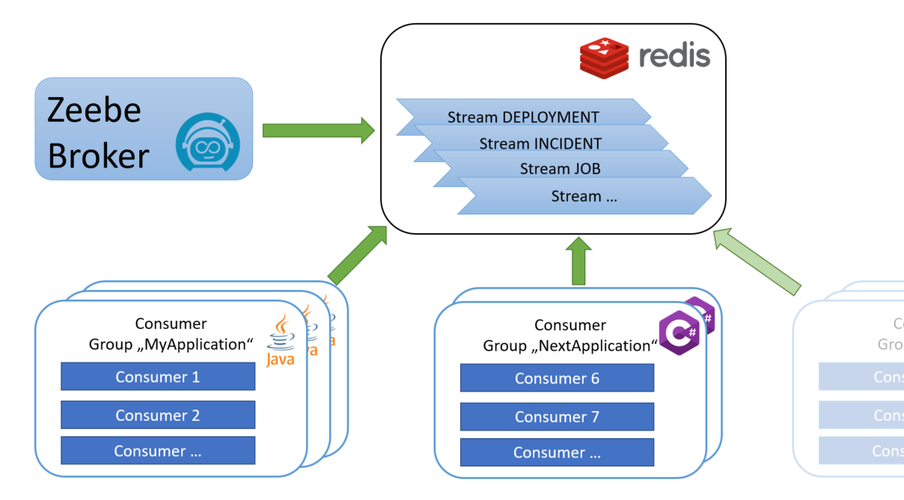
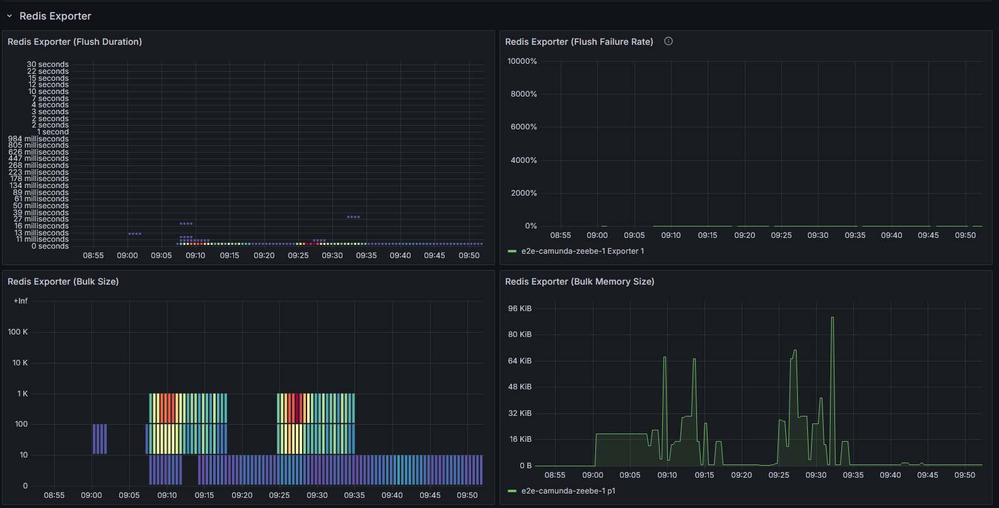

# zeebe-redis-exporter

[](https://github.com/camunda-community-hub/community)
[](https://github.com/camunda-community-hub/community/blob/main/extension-lifecycle.md#compatiblilty)
[](https://github.com/Camunda-Community-Hub/community/blob/main/extension-lifecycle.md#incubating-)
[](https://maven-badges.sml.io/sonatype-central/io.zeebe.redis/zeebe-redis-exporter)
[](https://opensource.org/licenses/Apache-2.0)

Export records from [Zeebe](https://github.com/camunda-cloud/zeebe) to [Redis](https://redis.io/). Redis is an in-memory data store which is used as a transport layer.



The records are transformed into [Protobuf](https://github.com/camunda-community-hub/zeebe-exporter-protobuf) and added to [Redis Streams](https://redis.io/docs/data-types/streams-tutorial/). The exporter provides a time based history cleanup including an optional "delete-after-acknowledge" feature for streamed data.

Multiple applications can read from such streams each using a unique consumer group. Scaling of consumers per consumer group can then be achieved by using a unique consumer ID. Separation of concerns is possible by reading from different streams.

The Java connector provides a convenient way to read the records from Redis Streams.

## Why Redis?

Redis ([https://redis.io/](https://redis.io/)) offers a lot of options to us. We can use it as fast in-memory technology and simple transport layer. We can optionally add persistence, but it is not required. We have Redis streams at our hand which are great when we want to use multiple consumers and scaling on the event receiver side. In Java the Lettuce client ([https://lettuce.io/](https://lettuce.io/)) offers great connectivity features out of the box, so that the exporter itself is easy to maintain. …

If neither the Hazelcast nor the Kafka exporter fits your exact needs, this could be the one you’re looking for.

If you have any suggestions, please let us know - it's a community project.

## Prerequisites

* Camunda 8.7+
* For Camunda versions 8.5 to 8.6 please use version 1.1.0 of this exporter
* For Camunda versions 8.2 to 8.4 please use version 0.9.11 of this exporter 

## Usage

### Java Application

Add the Maven dependency to your `pom.xml`

```
<dependency>
	<groupId>io.zeebe.redis</groupId>
	<artifactId>zeebe-redis-connector</artifactId>
	<version>2.0.0</version>
</dependency>
```

Connect to Redis and register a listener

```java
final RedisClient redisClient = RedisClient.create("redis://localhost:6379");
        
final ZeebeRedis zeebeRedis = ZeebeRedis.newBuilder(redisClient)
        .consumerGroup("MyApplication").consumerId("consumer-1")
        .addDeploymentListener(deployment -> { ... })
        .addIncidentListener(incident -> { ... })
        .addJobListener(job -> { ... })
        .addUserTaskListener(userTask -> { ... })
        .build();

// ...

zeebeRedis.close();
redisClient.shutdown();
```
**Hint**: It is strongly recommended to set at least the consumer group name. Otherwise, you will get a unique disposable group generated at startup. 


#### Dealing with Lettuce versions

Under the hood the exporter and the connector uses Lettuce as Redis client.
Please be aware that the connector requires at minimum `io.lettuce:lettuce-core:6.2.2.RELEASE`. In case your project uses a parent POM with lower and potentially incompatible versions you have to take care to deactivate them.
E.g. do something like
```
  <properties>
    <!-- unset lettuce version of spring boot starter parent -->
    <lettuce.version></lettuce.version>
  </properties>

```

#### Dealing with unstable connections

The Lettuce based Redis client itself is able to automatically reconnect to the Redis server once the connection is lost.
However there are network setups, where Lettuce cannot recover from such problems. In order to deal with these situations
there are optional configuration parameters forcing the connector to create a new connection upon reconnect attempts:

```java
final ZeebeRedis zeebeRedis = ZeebeRedis.newBuilder(redisClient)
        .withReconnectUsingNewConnection()
        .reconnectInterval(Duration.ofSeconds(1))
        ...
```

#### Immediate deletion of successful handled messages

If you want to deactivate the general cleanup of the exporter (see section "Configuration") and instead want
to delete successful handled messages on client side the connector provides an optional setting:

```java
final ZeebeRedis zeebeRedis = ZeebeRedis.newBuilder(redisClient)
        .deleteMessagesAfterSuccessfulHandling(true)
        ...
```
This will immediately delete messages after they have been acknowledged. Please be aware that this does not consider 
foreign consumer groups! And it will send an `xdel` command for each single received message. 
This might be an option to choose in case you have exactly one consumer group and not a high load.

Enhanced exporter side algorithms can be found in the exporter's configuration section.

Of course it is possible to combine this simple client side mechanism with the exporter mechanism.
Hence the choice is yours.

#### Tuning connector performance

Reading Redis streams is carried out by using the `XREAD COUNT count BLOCK milliseconds ...` command. In order to tune
connector performance you are able to set the count (maximum number of messages read at once, default is 500) and block milliseconds (maximum blocking time, default is 2000) parameter:

```java
final ZeebeRedis zeebeRedis = ZeebeRedis.newBuilder(redisClient)
        .xreadCount(500).xreadBlockMillis(2000)
        ...
```

*Additional hints*

When creating the Redis Client it might as well help to set an appropriate IO-ThreadPool-Size. Default of the RedisClient is the number of available processors but not smaller than 2.

```java
var redisClient = RedisClient.create(
        ClientResources.builder().ioThreadPoolSize(4).build(),
        redisAddress);
```

### .NET Application

See [connector-csharp/README.md](https://github.com/camunda-community-hub/zeebe-redis-exporter/blob/main/connector-csharp/README.md)

## Install

### Docker

A docker image is published to [GitHub Packages](https://github.com/orgs/camunda-community-hub/packages/container/package/zeebe-with-redis-exporter) that is based on the Zeebe image and includes the Redis exporter (the exporter is enabled by default).

```
docker pull ghcr.io/camunda-community-hub/zeebe-with-redis-exporter:8.7.7-2.0.0
```

For a local setup, the repository contains a [docker-compose file](docker/docker-compose.yml). It starts a Zeebe broker with the Redis exporter.

```
mvn clean install -DskipTests
cd docker
docker-compose up -d
```

### Manual

1. Download the latest [Zeebe distribution](https://github.com/camunda-cloud/zeebe/releases) _(camunda-zeebe-%{VERSION}.tar.gz
   )_

1. Download the latest [exporter JAR](https://github.com/camunda-community-hub/zeebe-redis-exporter/releases) (_zeebe-redis-exporter-2.0.0-jar-with-dependencies.jar_)

1. Copy the exporter JAR  into the broker folder `~/zeebe-broker-%{VERSION}/exporters`.

    ```
    cp exporter/target/zeebe-redis-exporter-2.0.0-jar-with-dependencies.jar ~/zeebe-broker-%{VERSION}/exporters/
    ```

1. Add the exporter to the broker configuration `~/zeebe-broker-%{VERSION}/config/application.yaml`:

    ```
    zeebe:
      broker:  
        exporters:
          redis:
            className: io.zeebe.redis.exporter.RedisExporter
            jarPath: exporters/zeebe-redis-exporter-2.0.0-jar-with-dependencies.jar
    ```

1. Set the environment variable `ZEEBE_REDIS_REMOTE_ADDRESS` to your Redis URL.

1. Start the broker
   `~/zeebe-broker-%{VERSION}/bin/broker`

### Configuration

Setting the Redis remote address is mandatory.

In the Zeebe configuration, you can furthermore change

* whether to use a cluster client
* the value and record types which are exported
* the intents which are exported (with fuzzy or strict filtering)
* the name resulting in a stream prefix
* the cleanup cycle
* the minimum time-to-live of exported records
* the maximum time-to-live of exported records
* a flag indicating whether to delete acknowledged messages
* batch size and cycle
* the record serialization format

Default values:

```
zeebe:
  broker:
    exporters:
      redis:
        className: io.zeebe.redis.exporter.RedisExporter
        jarPath: exporters/zeebe-redis-exporter.jar
        args:
          # Redis connection url (redis://...)
    	  # remoteAddress: 
   
          # whether to use the Redis cluster client
          useClusterClient: false
          
          # comma separated list of io.zeebe.protocol.record.ValueType to export or empty to export all types 
          enabledValueTypes: ""
    
          # comma separated list of io.zeebe.protocol.record.RecordType to export or empty to export all types
          enabledRecordTypes: ""
          
          # comma separated list or map of io.camunda.zeebe.protocol.record.intent.Intent to export or empty to export all intents.
          enabledIntents: ""
        
          # Redis Stream prefix
          name: "zeebe"

          # Redis stream data cleanup cycle time in seconds. Default is 1 minute. Set to 0 or -1 in order to completely disable cleanup.
          cleanupCycleInSeconds: 60

          # Redis stream data minimum time-to-live in seconds. Default is 0 (disabled). Set to a value > 0 in order to keep acknowledged messages alive for a minimum time.  
          minTimeToLiveInSeconds: 0

          # Redis stream data maximum time-to-live in seconds. Default is 5 minutes. Set to 0 or -1 in order to prevent max TTL cleanup.  
          maxTimeToLiveInSeconds: 300

          # Redis stream automatic cleanup of acknowledged messages. Default is false.   
          deleteAfterAcknowledge: false

          # Job timeout for Redis consumers. Default is 5 minutes. Set to 0 or -1 in order to prevent resending pending messages.
          consumerJobTimeoutInSeconds: 300

          # Idle timeout for Redis consumers. Default is 24 hours. Set to 0 or -1 in order to prevent cleaning up inactive consumers.
          consumerIdleTimeoutInSeconds: 86400

          # Redis stream keys scan cycle. Default is 15 minutes. Set to 0 or -1 in order to prevent scanning for new streams to be considered in cleanup.
          keyScanCycleInSeconds: 900

          # Redis Client IO-Thread-Pool-Size. Default is number of available processors but not smaller than 2.
          ioThreadPoolSize: 2

          # Redis batch size for flushing commands when sending data to Redis streams. Default is 250. Maximum number of events which will be flushed simultaneously.
          batchSize: 250

          # Redis batch cycle in milliseconds for sending data to Redis streams. Default is 500. Even if the batch size has not been reached events will be sent after this time.
          batchCycleMillis: 500

          # record serialization format: [protobuf|json]
          format: "protobuf"
```

The values can be overridden by environment variables with the same name and a `ZEEBE_REDIS_` prefix (e.g. `ZEEBE_REDIS_MAX_TIME_TO_LIVE_IN_SECONDS`, `ZEEBE_REDIS_USE_CLUSTER_CLIENT`, ...). 

Especially when it comes to `ZEEBE_REDIS_REMOTE_ADDRESS` it is recommended to define it as environment variable
and not within the more internal `application.yaml` configuration.

<details>
  <summary>Full docker-compose.yml with Redis</summary>
  <p>

```
version: "2"

networks:
  zeebe_network:
    driver: bridge

services:
  zeebe:
    container_name: zeebe_broker
    image: camunda/zeebe:8.7.5
    environment:
      - ZEEBE_REDIS_REMOTE_ADDRESS=redis://redis:6379
    ports:
      - "26500:26500"
      - "9600:9600"
    volumes:
      - ../exporter/target/zeebe-redis-exporter-2.0.0-jar-with-dependencies.jar:/usr/local/zeebe/exporters/zeebe-redis-exporter.jar
      - ./application.yaml:/usr/local/zeebe/config/application.yaml
    networks:
      - zeebe_network
    depends_on:
      - redis

  redis:
    container_name: redis_cache
    image: redis:7-alpine
    ports:
      - "6379:6379"
    networks:
      - zeebe_network

```      

</p>
</details>

Check out the Redis documentation on how to [manage](https://redis.io/docs/management/) Redis, configure optional persistence, run in a cluster, etc.

#### Intent Filtering
*Since 2.1.0*

The exporter supports fine-grained intent filtering to control which specific intents are exported. This provides two filtering modes:

| **Parameter**                        | **Description**                                                                                                                                         |
|--------------------------------------|---------------------------------------------------------------------------------------------------------------------------------------------------------|
| `ZEEBE_REDIS_ENABLED_INTENTS`        | Controls which intents are exported. Supports both fuzzy and strict filtering modes (see examples below).                                              |

##### - Fuzzy Intent Filtering (Simple List)

Export specific intents across all intent classes:
```
ZEEBE_REDIS_ENABLED_INTENTS="CREATED,UPDATED,COMPLETED"
```

This will export `CREATED`, `UPDATED`, and `COMPLETED` intents from all intent classes that have these intents (e.g., `JobIntent.CREATED`, `ProcessIntent.CREATED`, `DeploymentIntent.CREATED`, etc.).

##### - Strict Intent Filtering (Class-Specific)

Export specific intents only from designated intent classes:
```
ZEEBE_REDIS_ENABLED_INTENTS="JobIntent=CREATED,UPDATED,COMPLETED;DeploymentIntent=CREATED;ProcessIntent=ACTIVATED,COMPLETED"
```

This provides precise control by specifying which intents to export from each intent class:
- `JobIntent`: Only `CREATED`, `UPDATED`, and `COMPLETED` 
- `DeploymentIntent`: Only `CREATED`
- `ProcessIntent`: Only `ACTIVATED` and `COMPLETED`

##### - Default Behavior

When `ZEEBE_REDIS_ENABLED_INTENTS` is not configured or empty, all intents are exported (maintains backward compatibility).

The exporter automatically detects the filtering mode based on the configuration format:
- Contains `=` → Strict filtering mode
- No `=` → Fuzzy filtering mode

#### Cleanup

The cleanup mechanism consists of the following options:

| **Parameter**                                  | **Description**                                                                                                                                                                                        |
|------------------------------------------------|--------------------------------------------------------------------------------------------------------------------------------------------------------------------------------------------------------|
| `ZEEBE_REDIS_CLEANUP_CYCLE_IN_SECONDS`         | General cleanup cycle. Default is `60` (1 minute). A value of zero or below will completely disable any cleanup.                                                                                       |
| `ZEEBE_REDIS_MIN_TIME_TO_LIVE_IN_SECONDS`      | The minimum time to live. Default is `0` (disabled). Set a value greater than zero in order to keep acknowledged messages alive for a minimum time.                                                    |
| `ZEEBE_REDIS_MAX_TIME_TO_LIVE_IN_SECONDS`      | The maximum time to live. Default is `300` (5 minutes). A value of zero or below will prevent cleanup with max TTL.                                                                                    |
| `ZEEBE_REDIS_DELETE_AFTER_ACKNOWLEDGE`         | Whether to automatically delete acknowledged messages. Default value is `false` (disabled). Set to `true` in order to enable the feature.                                                              |
| `ZEEBE_REDIS_CONSUMER_JOB_TIMEOUT_IN_SECONDS`  | Job timeout for consumers. Pending (not acknowledged) messages will be resent to the stream after the timeout. Default is `300` (5 minutes). A value of zero or below will prevent resending messages. |
| `ZEEBE_REDIS_CONSUMER_IDLE_TIMEOUT_IN_SECONDS` | Idle timeout for consumers. Consumers being inactive for a too long time will be deleted. Default is `86400` (24 hours). A value of zero or below will prevent cleaning up inactive consumers.         |
| `ZEEBE_REDIS_KEY_SCAN_CYCLE_IN_SECONDS`        | Scan cycle for new Zeebe streams (created by other instances) to be considered during cleanup. Default is `900` (15 minutes). A value of zero or below will prevent scanning for new streams.          |


The maximum TTL configuration is a safety net to cleanup all messages after a certain timespan. This can be used alone or in combination with the "delete-after-acknowledge" feature.
If combined not acknowledged messages will be deleted anyway after max TTL. In case you want to keep messages alive for a certain timespan despite they have already been acknowledged
the min TTL configuration is at your hand.

The "delete-after-acknowledge" feature is based on the Redis `xinfogroups` command returning a list of all consumer groups having consumed data together with their “last-delivered-id”. 
If there are pending messages the algorithm will additionally consider the lowest ID of the Redis `xpending` command result in order to delete only acknowledged messages.
Please be aware that messages must have been acknowledged by all known consumer groups in order to be cleaned up.

This works extremely well - as long as consumers do not crash and always acknowledge their messages properly. In order to recognize pending messages that are no longer being processed, you have the "consumer-job-timeout" at your disposal.
In case a message has been read but not acknowledged for a timer greater than the "consumer-job-timeout" it will be claimed
using the `xautoclaim` command and resent to the stream. Messages older than max TTL will be deleted anyway.

Furthermore, each consumer group has a list of its consumers. If you have a crashing consumer it will remain in this list forever.
In order to cleanup supposedly inactive consumers the cleanup algorithm will look for the youngest consumer and it's idle time.
Any consumer having a longer idle time than the youngest consumer plus the configured consumer idle timeout will be removed.

Cleanup is synchronized between different Zeebe nodes so that the cleanup does not run multiple times on each node but only once.

Hence, the cleanup algorithm can run on any of the Zeebe nodes. The streams to be taken into account during the cleanup are, of course,
all streams to which data is exported from this node. But this, of course, might not be enough. In order to have a list of actual streams 
(represented as keys in Redis) the cleanup algorithm scans regularly for new streams created by other Zeebe nodes or even created before
the startup of the current Zeebe node. With that the cleanup will automatically take into account all Zeebe streams available in Redis 
and ensure optimal garbage collection.

#### Tuning exporter performance

In order to tune the exporter performance you have the following options available:

| **Parameter**                     | **Description**                                                                                                                                         |
|-----------------------------------|---------------------------------------------------------------------------------------------------------------------------------------------------------|
| `ZEEBE_REDIS_BATCH_SIZE`          | Batch size for flushing commands when sending data. Default is `250`. More precisely the maximum number of events which will be flushed simultaneously. |
| `ZEEBE_REDIS_BATCH_CYCLE_MILLIS`  | Batch cycle in milliseconds for sending data. Default is `500`. Even if the batch size has not been reached events will be sent after this time.        |
| `ZEEBE_REDIS_IO_THREAD_POOL_SIZE` | Redis Client IO-Thread-Pool-Size. Default is number of available processors but not smaller than `2`.                                                   |

The exporter queues records and sends them every `ZEEBE_REDIS_BATCH_CYCLE_MILLIS`. Sending data then does not use the default auto-flush / flush-after-write mode of Lettuce but groups multiple 
commands in a batch using `ZEEBE_REDIS_BATCH_SIZE` as maximum thus increasing the throughput. According to the Lettuce documentation batches are recommended to have a size between 50 and 1000.

### Using Redis clusters

When connecting to Redis clusters the underlying Lettuce client must use the `RedisClusterClient` which differs from the standard `RedisClient`.
In order to activate the cluster client usage of the exporter set `ZEEBE_REDIS_USE_CLUSTER_CLIENT=true` in your environment.

On the connector side it's your own responsibility to create the `RedisClusterClient` and use it:

```
final RedisClusterClient redisClient = RedisClusterClient.create(...);
        
final ZeebeRedis zeebeRedis = ZeebeRedis.newBuilder(redisClusterClient)
        .withStandardClusterOptions()
        .consumerGroup("MyApplication").consumerId("consumer-1")
        .addIncidentListener(incident -> { ... })
        .addJobListener(job -> { ... })
        .addUserTaskListener(userTask -> { ... })
        .build();
```

The optional method `withStandardClusterOptions()` activates several cluster topology refresh options
and filters out failed nodes from the topology. It sets / overrides the cluster client options and 
might be a good option if you do not have any specific own requirements.

**Sharding in Redis clusters**

When using the standard `RedisClient` the connector uses a Multi-key operation to receive events from Redis. 
Some Multi-key operations - including stream commands - are not possible in a cluster. We would
experience errors saying `CROSSSLOT Keys in request don't hash to the same slot` on the connector side.

In the case of Redis clusters each stream (which corresponds to a Zeebe `ValueType`) will end up in its own shard.
The connector - if initialized correctly with the `RedisClusterClient` - then uses multiple connections to read from each stream individually based on the asynchronous connection pool support of Lettuce.

### Obtaining Metrics

The Redis Exporter provides metrics via Spring Boot Actuator similar to the OpenSearch Exporter:

* `zeebe.redis.exporter.bulk.memory.size` - Exporter bulk memory size
* `zeebe.redis.exporter.bulk.size` - Exporter bulk size
* `zeebe.redis.exporter.flush.duration.seconds` - Flush duration of bulk exporters in seconds
* `zeebe.redis.exporter.failed.flush` - Number of failed flush operations
 
Metrics are recorded each batch cycle and are related to the sum of all events exported during such a single cycle.



* For a sample Grafana dashboard see [zeebe-redis.json](docs/zeebe-redis.json)
* For more about Zeebe metrics go to [Camunda 8 Docs | Operational guides > Monitoring > Metrics](https://docs.camunda.io/docs/self-managed/operational-guides/monitoring/metrics/) 

## Build it from Source

The exporter and the Java connector can be built with Maven

`mvn clean install`

## Code of Conduct

This project adheres to the Contributor Covenant [Code of
Conduct](/CODE_OF_CONDUCT.md). By participating, you are expected to uphold
this code. Please report unacceptable behavior to
code-of-conduct@zeebe.io.
