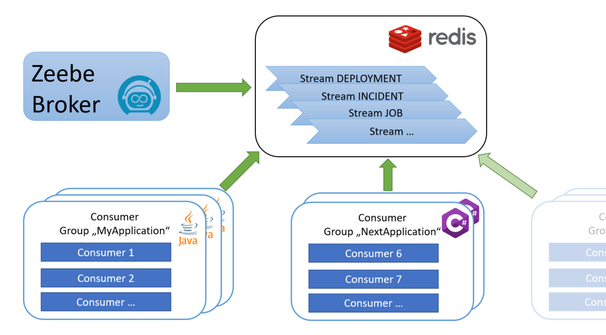

# zeebe-redis-exporter

[](https://github.com/camunda-community-hub/community)
[](https://github.com/Camunda-Community-Hub/community/blob/main/extension-lifecycle.md#incubating-)
[](https://opensource.org/licenses/Apache-2.0)

[](https://github.com/camunda-community-hub/community/blob/main/extension-lifecycle.md#compatiblilty)

Export records from [Zeebe](https://github.com/camunda-cloud/zeebe) to [Redis](https://redis.io/). Redis is an in-memory data store which is used as a transport layer.



The records are transformed into [Protobuf](https://github.com/camunda-community-hub/zeebe-exporter-protobuf) and added to [Redis Streams](https://redis.io/docs/data-types/streams-tutorial/). The exporter provides a time based history cleanup for streamed data.

Multiple applications can read from such streams each using a unique consumer group. Scaling of consumers per consumer group can then be achieved by using a unique consumer ID. Separation of concerns is possible by reading from different streams.

The Java connector provides a convenient way to read the records from Redis Streams.

## Hint

This project is still in incubation phase. It works, but especially the Java connector may be subject to changes, for example with regard to topics such as error handling, restarting, etc. The topic of cleaning up the messages in Redis has also not yet been finally thought through.

If you have any suggestions, please let us know - it's a community project.

## Usage

### Java Application

Add the Maven dependency to your `pom.xml`

```
<dependency>
	<groupId>io.zeebe.redis</groupId>
	<artifactId>zeebe-redis-connector</artifactId>
	<version>0.9.1</version>
</dependency>
```

Connect to Redis and register a listener

```java
final RedisClient redisClient = RedisClient.create("redis://localhost:6379");
        
final ZeebeRedis zeebeRedis = ZeebeRedis.newBuilder(redisClient)
        .consumerGroup("MyApplication").consumerId("consumer-1")
        .addDeploymentListener(deployment -> { ... })
        .addIncidentListener(incident -> { ... })
        .addJobListener(job -> { ... })
        .build();

// ...

zeebeRedis.close();
redisClient.shutdown();
```
#### Dealing with unstable connections
*Since 0.9.1*

The Lettuce based Redis client itself is able to automatically reconnect to the Redis server once the connection is lost.
However there are network setups, where Lettuce cannot recover from such problems. In order to deal with these situations
there are optional configuration parameters forcing the connector to create a new connection upon reconnect attempts:

```java
final ZeebeRedis zeebeRedis = ZeebeRedis.newBuilder(redisClient)
        .withReconnectUsingNewConnection()
        .reconnectInterval(Duration.ofSeconds(1))
        ...
```

#### Immediate deletion of successful handled messages
*Since 0.9.1*

If you want to deactivate the general `timeToLiveInSeconds` setting of the exporter (see section "Configuration") and instead want
to delete successful handled messages on client side the connector provides an optional setting:

```java
final ZeebeRedis zeebeRedis = ZeebeRedis.newBuilder(redisClient)
        .deleteMessagesAfterSuccessfulHandling(true)
        ...
```
Hence the choice is yours. And of course you are able to combine both.

## Install

### Docker

A docker image is published to [GitHub Packages](https://github.com/orgs/camunda-community-hub/packages/container/package/zeebe-with-redis-exporter) that is based on the Zeebe image and includes the Redis exporter (the exporter is enabled by default).

```
docker pull ghcr.io/camunda-community-hub/zeebe-with-redis-exporter:8.1.6-0.9.1
```

For a local setup, the repository contains a [docker-compose file](docker/docker-compose.yml). It starts a Zeebe broker with the Redis exporter.

```
mvn clean install -DskipTests
cd docker
docker-compose up -d
```

### Manual

1. Download the latest [Zeebe distribution](https://github.com/camunda-cloud/zeebe/releases) _(camunda-zeebe-%{VERSION}.tar.gz
   )_

1. Download the latest [exporter JAR](https://github.com/camunda-community-hub/zeebe-redis-exporter/releases) (_zeebe-redis-exporter-0.9.1-jar-with-dependencies.jar_)

1. Copy the exporter JAR  into the broker folder `~/zeebe-broker-%{VERSION}/exporters`.

    ```
    cp exporter/target/zeebe-redis-exporter-0.9.1-jar-with-dependencies.jar ~/zeebe-broker-%{VERSION}/exporters/
    ```

1. Add the exporter to the broker configuration `~/zeebe-broker-%{VERSION}/config/application.yaml`:

    ```
    zeebe:
      broker:  
        exporters:
          redis:
            className: io.zeebe.redis.exporter.RedisExporter
            jarPath: exporters/zeebe-redis-exporter-0.9.1-jar-with-dependencies.jar
    ```

1. Set the environment variable `ZEEBE_REDIS_REMOTE_ADDRESS` to your Redis URL.

1. Start the broker
   `~/zeebe-broker-%{VERSION}/bin/broker`

### Configuration

Setting the Redis remote address is mandatory.

In the Zeebe configuration, you can furthermore change

* the value and record types which are exported
* the name resulting in a stream prefix
* the time-to-live of exported records
* the record serialization format

Default values:

```
zeebe:
  broker:
    exporters:
      redis:
        className: io.zeebe.redis.exporter.RedisExporter
        jarPath: exporters/zeebe-redis-exporter.jar
        args:
          # Redis connection url (redis://...)
    	  # remoteAddress: 
   
          # comma separated list of io.zeebe.protocol.record.ValueType to export or empty to export all types 
          enabledValueTypes: ""
    
          # comma separated list of io.zeebe.protocol.record.RecordType to export or empty to export all types
          enabledRecordTypes: ""
        
          # Redis Stream prefix
          name: "zeebe"

          # Redis stream data time-to-live in seconds. Default is 5 minutes. Set to zero in order to prevent cleanup.  
          timeToLiveInSeconds: 300

          # record serialization format: [protobuf|json]
          format: "protobuf"
```

The values can be overridden by environment variables with the same name and a `ZEEBE_REDIS_` prefix (e.g. `ZEEBE_REDIS_TIME_TO_LIVE_IN_SECONDS`). 

Especially when it comes to `ZEEBE_REDIS_REMOTE_ADDRESS` it is recommended to define it as environment variable
and not within the more internal `application.yaml` configuration.


<details>
  <summary>Full docker-compose.yml with Redis</summary>
  <p>

```
version: "2"

networks:
  zeebe_network:
    driver: bridge

services:
  zeebe:
    container_name: zeebe_broker
    image: camunda/zeebe:8.1.6
    environment:
      - ZEEBE_LOG_LEVEL=debug
      - ZEEBE_REDIS_REMOTE_ADDRESS=redis://redis:6379
    ports:
      - "26500:26500"
      - "9600:9600"
    volumes:
      - ../exporter/target/zeebe-redis-exporter-0.9.1-jar-with-dependencies.jar:/usr/local/zeebe/exporters/zeebe-redis-exporter.jar
      - ./application.yaml:/usr/local/zeebe/config/application.yaml
    networks:
      - zeebe_network
    depends_on:
      - redis

  redis:
    container_name: redis_cache
    image: redis:7-alpine
    ports:
      - "6379:6379"
    networks:
      - zeebe_network

```      

</p>
</details>

Check out the Redis documentation on how to [manage](https://redis.io/docs/management/) Redis, configure optional persistence, run in a cluster, etc.

## Build it from Source

The exporter and the Java connector can be built with Maven

`mvn clean install`

## Code of Conduct

This project adheres to the Contributor Covenant [Code of
Conduct](/CODE_OF_CONDUCT.md). By participating, you are expected to uphold
this code. Please report unacceptable behavior to
code-of-conduct@zeebe.io.
